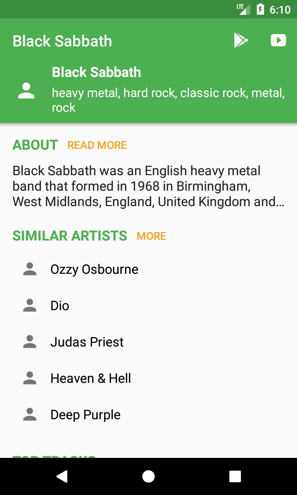
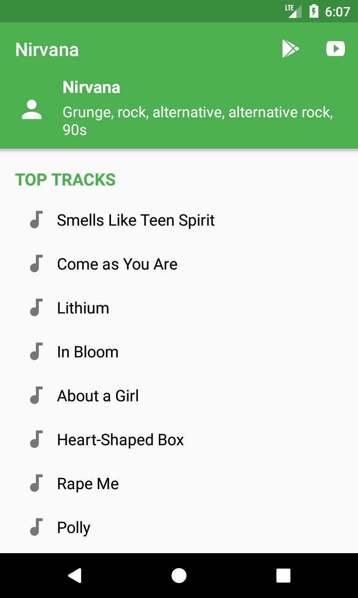
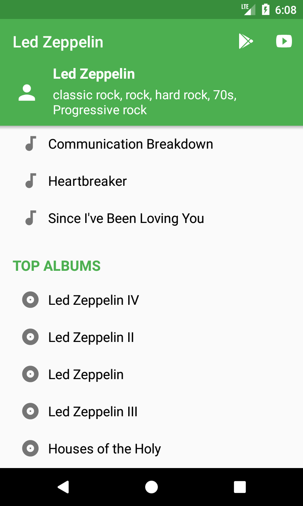
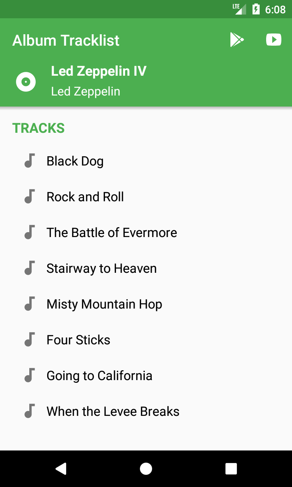

# Similar Artists

Android App that helps you to find artists and bands similar to the ones you like. 

    

## Screenshots

## Setup
Get your Developer API Key at https://www.last.fm/api/account/create and modify the constant LAST_FM_KEY at [RetrofitInitializer.java](app/src/main/java/newscavazzini/similarartists/retrofit/RetrofitInitializer.java#L31)

#### Licensing
Similar Artists is licensed under the GNU v3 Public License.
